#  TrackMate – Smart Expense Tracker System

**TrackMate** is a full-featured personal expense tracker that lets you **log daily expenses, analyze insights, manage history, and set monthly budgets** — all through a beautiful, intuitive interface.

Built with **HTML**, **CSS**, **JavaScript**, **Node.js**, **MySQL**, TrackMate features a polished **glassmorphism UI**, smooth UX, and powerful data visualizations to help users make better financial decisions.

---

## 🌐 Live Demo  
**🔗 [TrackMate – Smart Expense Tracker](https://trackmate-smart-expense-tracker.netlify.app)**

---

## 📸 Screenshots & Features

---

### ✅ Signup Page  
> Create a new account using a modern and responsive form.

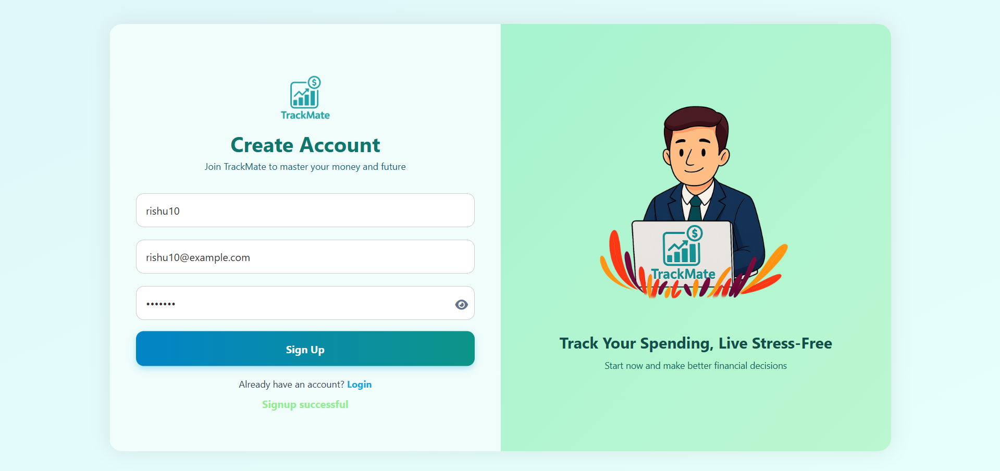

---

### 🔑 Login Page  
> Securely log in and instantly access your personal expense dashboard.

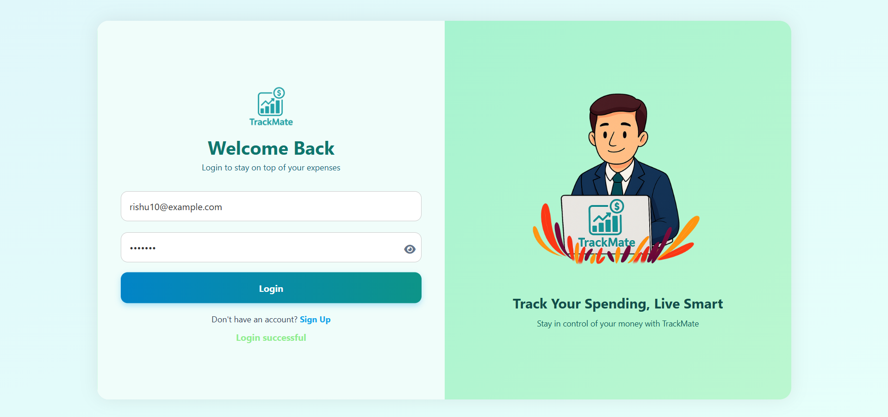

---

### 🧭 Dashboard – Control Panel  
> Home hub to access all core features:
- Add Expense  
- Monthly Summary  
- Expense History  
- Insights  
- Set Your Budget 
- Smart Tips  

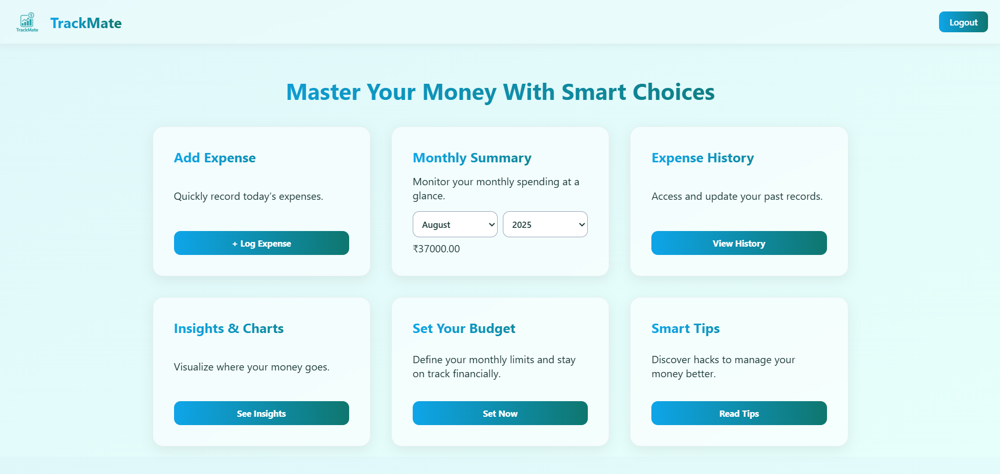

---

### ➕ Add Expense Modal  
> Easily log expenses with the following details:
- Name  
- Date  
- Amount  
- Payment Mode (Cash, Card, UPI, Other)  
- Category (Food, Travel, Shopping, etc.)

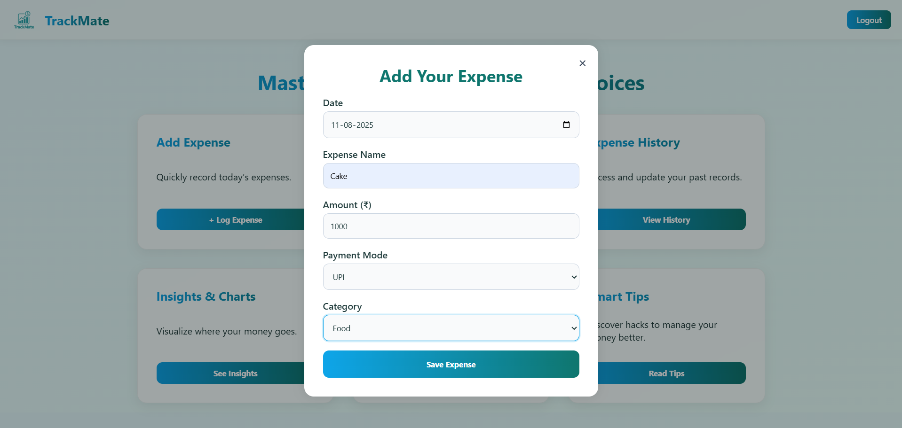

---

### 📆 Monthly Summary  
> Overview of your monthly expenses with instant filtering by month and year.

---

### 📂 Expense History  
> Detailed and interactive history of all logged expenses.
- Filter by date range  
- Edit entries in-place  
- Delete expenses instantly  
- Fully responsive and visually enhanced layout

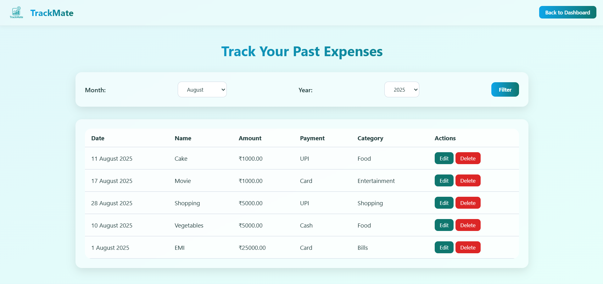

---

### 📊 Insights – Visual Analytics

TrackMate provides **actionable insights** using **beautiful Chart visualizations**.

1. **Monthly Summary (Info Cards)**  
   → See total spent, top category, average daily spend, and peak spending month.  
   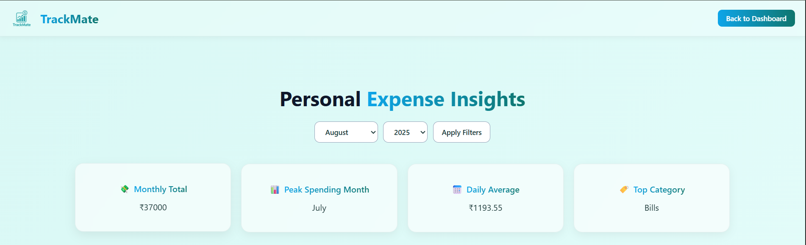

2. **Payment Type Distribution (Pie Chart)**  
   → Analyze which payment modes (Cash, Card, UPI) you use the most.  
   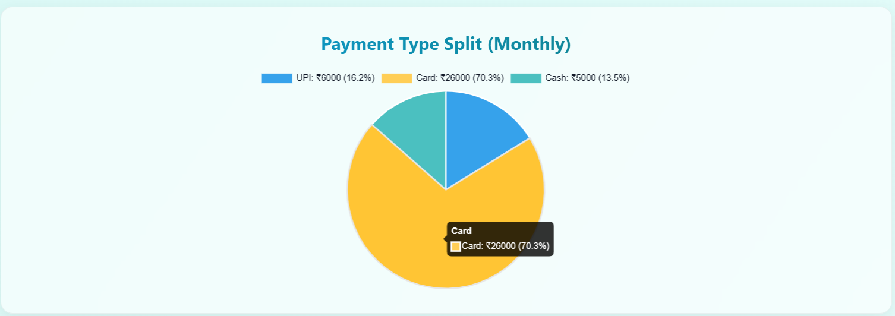

3. **Monthly Spending Trend (Line Chart)**  
   → Visualize how your expenses fluctuate across the year.  
   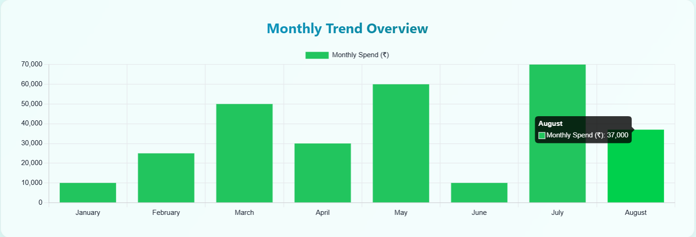

4. **Category-wise Spending (Donut Chart)**  
   → Understand your spending patterns by category.  
   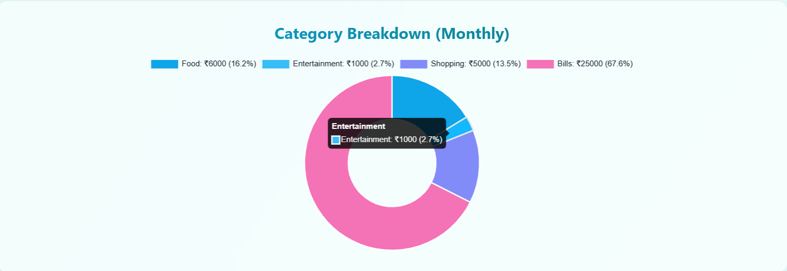

5. **Top 5 Expenses**  
   → See your highest individual expenses for the selected month.  
   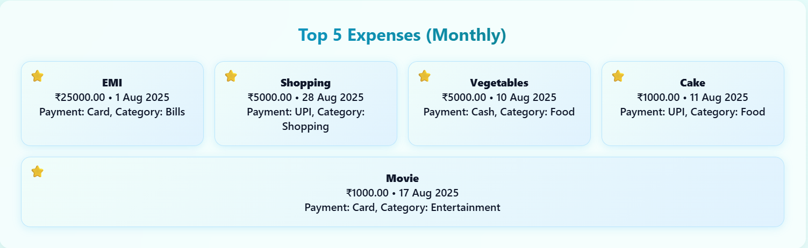

---

### 🧮 Set Your Budget 
> Set monthly spending limits.  
You can:
- Add budgets for specific months  
- Edit existing entries  
- Delete budgets anytime  

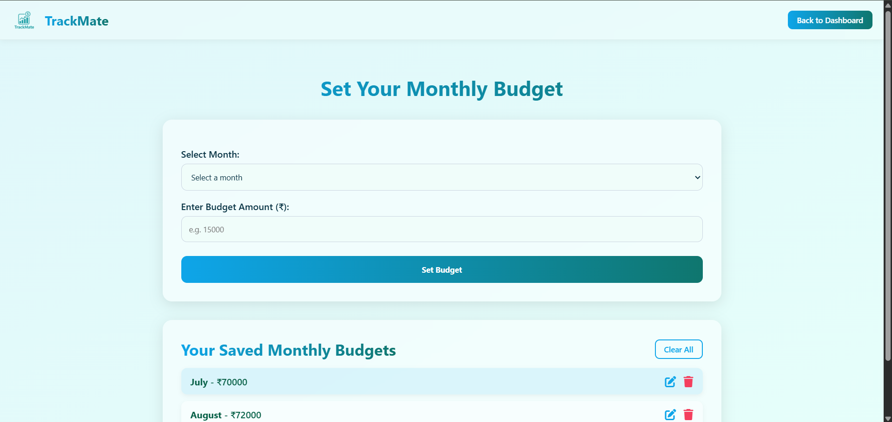

---

### 💡 Smart Tips  
> A collection of helpful financial advice, quotes, and spending hacks to keep you motivated and informed.

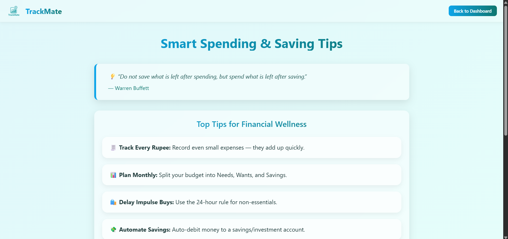

---

## ⚙️ How to Run Locally

### 1. Clone the Repository
```bash
git clone https://github.com/your-username/trackmate-expense-tracker
cd trackmate-expense-tracker
```

### 2. Install Dependencies
```bash
npm install
```

### 3. Configure the Database
Import the SQL schema:
```bash
# In MySQL
SOURCE db/schema.sql;
```

Create a `.env` file in the root directory with your credentials:
```env
DB_HOST=localhost
DB_USER=your_mysql_username
DB_PASSWORD=your_mysql_password
DB_NAME=your_db_name
DB_PORT=3306
JWT_SECRET=your_secret_key
```

### 4. Start the Server
```bash
node backend/server.js
```

### 5. Open in Browser
```bash
http://localhost:3000
```
---

## 👤 Author

Developed by [Rishu Raj]  

---
